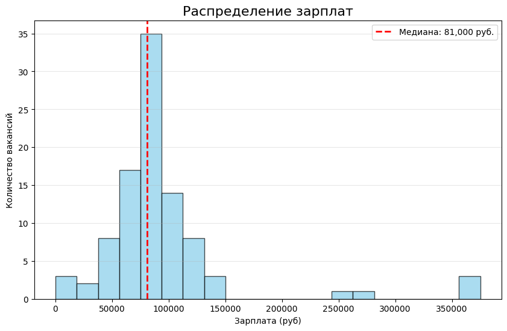
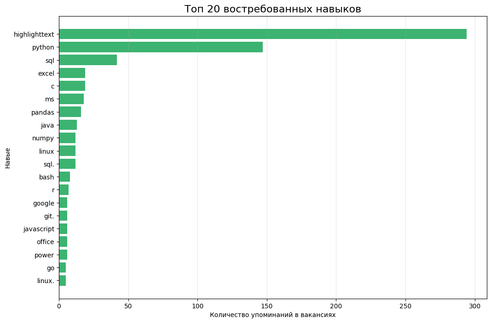

# Анализ рынка вакансий Python Junior на основе данных HH.ru

Этот проект представляет собой инструмент для автоматизированного сбора и анализа актуальных данных о вакансиях для начинающих Python-разработчиков. В основе проекта лежит полноценный ETL-процесс: выгрузка данных через API, их очистка, трансформация и последующая визуализация.

### Цели проекта
Проект создавался для того, чтобы изучить реальные требования работодателей к кандидатам и ответить на ключевые вопросы:
1. Каков реальный диапазон зарплат на начальных позициях?
2. Какие технологии и инструменты требуют чаще всего?
3. В каких городах больше всего предложений и какова доля удаленной работы?

---

### Используемые технологии
*   Язык программирования: Python 3.10+
*   Сбор данных: библиотека Requests (взаимодействие с открытым API HeadHunter)
*   Обработка и трансформация: Pandas, NumPy, модули AST и RE
*   Визуализация результатов: Matplotlib
*   Среда для интерактивного анализа: Jupyter Notebook

---

### Архитектура проекта
Для обеспечения чистоты кода и простоты поддержки проект разделен на независимые модули:
*   `src/config.py` — содержит централизованные настройки, параметры поиска и пути к файлам.
*   `src/collector.py` — отвечает за отправку запросов к API и сбор данных с учетом пагинации.
*   `src/cleaner.py` — выполняет очистку данных: извлекает значения из сложных JSON-структур, удаляет HTML-теги из описаний и обрабатывает пропуски.
*   `main.py` — главный файл, который последовательно запускает сборщик и обработчик данных.

---

### Результаты анализа

Ниже представлены графики, полученные в ходе исследования данных в Jupyter Notebook.

#### 1. Распределение предлагаемых зарплат
Большинство вакансий для Junior-специалистов находятся в диапазоне от 60 000 до 90 000 рублей. Использование медианного значения позволило отсечь редкие высокооплачиваемые вакансии и увидеть наиболее частые предложения.



#### 2. Востребованные навыки (автоматический анализ)



---

### Инструкция по запуску проекта

1. Склонируйте репозиторий к себе на компьютер:
   ```bash
   git clone https://github.com/ВАШ_НИК/hh-python-analysis.git
   cd hh-python-analysis

2. Установите необходимые библиотеки:
    ```bash
    pip install -r requirements.txt

3. Запустите процесс сбора и очистки данных:
    ```bash
    python main.py